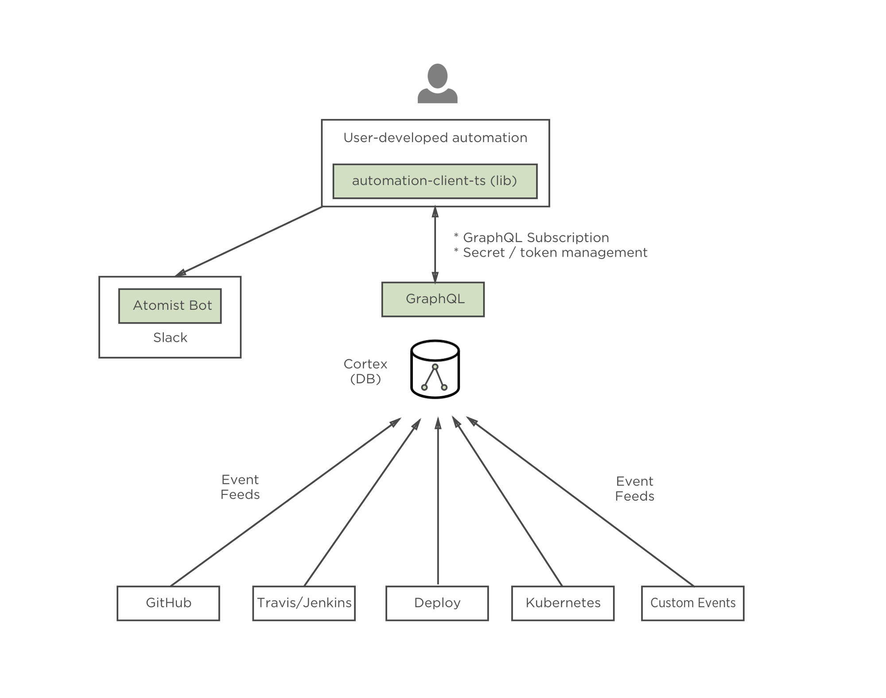

The Atomist development automation platform ingests events from your
software development systems:

-   Source code repositories like [GitHub.com][gh]
    and [GitHub Enterprise][ghe]
-   Issue tracking systems like GitHub and [Jira][jira]
-   Continuous integration platforms
    like [Travis CI][travis], [CircleCI][circle],
    and [Jenkins][jenkins]
-   Application frameworks like [Spring][spring]
-   Runtime platforms like [Kubernetes][k8] and [Cloud Foundry][cf]
-   Custom events from _any_ other system you use

and makes these events and their related data available to you via an
automation API.  As these events are ingested by Atomist, typically
via webhook JSON payloads, the individual events are automatically
connected, commits to pushes to builds to deployments to running
containers, so your automations always have the necessary context to
do the right thing.

The Atomist development automation platform also provides a simple yet
powerful interface for implementing custom bot commands.  By providing
all the infrastructure needed to hear commands, collect parameters,
execute the code, and respond back, Atomist let's you focus on writing
your bot command code, not all the ceremony around it.

The Atomist automation API can be accessed via any compliant client.
The reference implementation of the client is open source, written
in [TypeScript][ts], and available in
the [automation-client-ts][client-ts] GitHub repository and
via [NPM][aac].  The client can be used to query data _and_ register
custom bot commands & event subscriptions.

[gh]: https://github.com (GitHub.com)
[ghe]: https://enterprise.github.com/home (GitHub Enterprise)
[jira]: https://www.atlassian.com/software/jira (Jira)
[travis]: https://travis-ci.org (Travis CI)
[circle]: https://circleci.com (CircleCI)
[jenkins]: https://jenkins.io/ (Jenkins)
[spring]: https://spring.io/ (Spring)
[k8]: https://kubernetes.io/ (Kubernetes)
[cf]: https://www.cloudfoundry.org/ (Cloud Foundry)
[ts]: https://www.typescriptlang.org/ (TypeScript)
[client-ts]: https://github.com/atomist/automation-client-ts (Atomist Automation Client - TypeScript)
[aac]: https://www.npmjs.com/package/@atomist/automation-client (Atomist Automation Client Node Module)

## GraphQL

The Atomist automation API allows you to access the events and data
from your development platforms using [GraphQL][graphql], a modern,
standard query language and runtime for APIs.  GraphQL enables you to
get the exact data you want without making multiple API calls and
provides excellent tooling support for developers, including a
queryable, self-describing schema.  The Atomist automation API allows
you to use queries to fetch data directly, subscriptions to register
the types of events you want to receive, and limited mutations to
change data and make connections.

[graphql]: http://graphql.org/ (GraphQL)

## WebSockets

Unlike most API clients, the automation client must maintain contact
with the API server so that it may receive events and commands it is
interested in as they occur.  Rather than constant polling via HTTP
calls or requiring clients to open up firewall holes so the API server
can send events and commands to the client, the Atomist automation API
is accessed via a [WebSocket][ws] connection.  The WebSocket
connection is initiated by the automation client when it starts up,
establishing a persistent two-way communication channel between the
automation client and API that requires neither polling nor firewall
rule changes and is resilient to interruptions in connectivity.

[ws]: https://en.wikipedia.org/wiki/WebSocket (WebSocket)

---

In the following pages of this section, we will walk you
through

-   [setting up your system][prereq] for developing and running
    automations,
-   getting your [first automations running][quick],

provide a detailed look at writing your own

-   [bot commands][command] &
-   [event handlers][event],

and give you a in-depth description of

-   crafting sophisticated [Slack messages][slack],
-   using [GraphQL with the automation API][graphql-api],
-   building and starting an [automation client][client],
-   describing the anatomy of an automation client [project][], and
-   running an automation client on a [PaaS][paas].

With the knowledge available in this section, you'll have everything
you need to eliminate the pain points in your development and delivery
processes!

[prereq]: prerequisites.md (Atomist Automation Prerequisites)
[quick]: quick-start.md (Atomist Automation Quick Start)
[command]: commands.md (Atomist AUtomation Command Handlers)
[event]: events.md (Atomist Automation Event Handlers)
[slack]: slack.md (Atomist Automation Slack Messages)
[graphql-api]: graphql.md (Atomist Automation GraphQL)
[client]: client.md (Atomist Automation Client)
[project]: project.md (Atomist Automation Client Project)
[paas]: paas.md (Atomiat Automation Client on PaaS)
