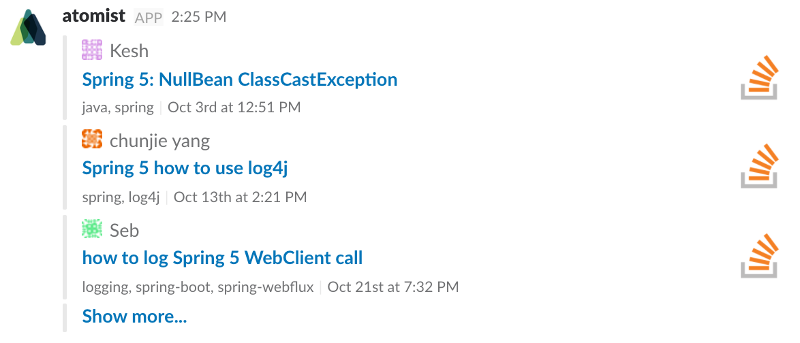

Develop your first automations: a bot command and an event handler.  

## Set up
First,
{!prereq-items.md!}

## Create a bot command

To create a custom bot command, you need to provide:

-   your command _intent_, i.e., the text users type when they
    want to invoke the command
-   descriptions of your command's input parameters, and
-   the code implementing your command.

Atomist recognizes when someone invokes the bot command
by sending the intent to the Atomist bot, then collects the required
parameters, and invokes the code implementing your command.  

This bot command searches [Stack Overflow][so] and replies with the results:

```typescript
@CommandHandler("Query Stack Overflow", "search so")
@Tags("stack-overflow")
export class SearchStackOverflow implements HandleCommand {

    @Parameter({description: "your search query", pattern: /^.*$/})
    public q: string;

    public handle(ctx: HandlerContext): Promise<HandlerResult> {
        return axios.get(`${apiSearchUrl}${encodeURIComponent(this.q)}`)
            .then(res => this.handleResult(res, this.q))
            .then(msg => ctx.messageClient.respond(msg))
            .then(() => Success, failure);
    }
}
```

Let's try it out.

!!! hint
    Setting up, building, and running an automation client follows
    the same steps as any other standard TypeScript or JavaScript
    project.

First, clone the project containing the above code and all the
necessary project files.

```
git clone https://github.com/atomist-blogs/sof-command.git atomist/sof-command \
    && cd atomist/sof-command
```

Next install the project dependencies.

```
npm install
```

Then build the project.

```
npm run build
```

Finally, start the client process on your local system.

```
npm start
```

This last command will start up the client, register the "search so"
bot command in your Slack team, and begin writing its logs to your
terminal.

Go ahead and test it by going to a channel in your Slack team that the
Atomist bot has been invited to and send the bot the command's intent.

```
@atomist search so q="spring 5"
```

If you don't provide a value for the query parameter, the Atomist bot
opens a thread and asks you to enter it.  You should get a response
that looks something like this: 



Congratulations, you just created your own bot command!

[slack]: slack.md (Atomist Automation Slack Messages)
[so]: https://stackoverflow.com/ (Stack Overflow)
[ts]: https://www.typescriptlang.org/ (TypeScript)
[axios]: https://www.npmjs.com/package/axios (Axios HTTP Client)

## Create an event handler

Event handlers react to GitHub pushes, updates to issues, pull
requests, or similar events.  

To create an event handler, you provide:

-   the type of event you want to react to
-   the code that implements your event handler

This event handler is triggered when a commit is pushed
to a repository - but only if the commit message contains
a string like "Crushed #77!" Here's the code:

```typescript
const Pattern = /[cC]rush(ed|ing)[\s]*#([0-9]*)/g;

@EventHandler("Find referenced GitHub issues and PRs in commit message", Subscription)
export class FindReferencedGitHubIssue implements HandleEvent<Commits> {

    public handle(event: EventFired<Commits>, ctx: HandlerContext): Promise<HandlerResult> {
        const commit = event.data.Commit[0];
        const referencedIssues: string[] = [];
        let match;
        while (match = Pattern.exec(commit.message)) {
            referencedIssues.push(`#${match[2]}`);
        }
        if (referencedIssues.length > 0 && commit.repo && commit.repo.channels) {
            const msg = `You crushed ${referencedIssues.join(", ")} with commit` +
                ` \`${commit.repo.owner}/${commit.repo.name}@${commit.sha.slice(0, 7)}\``;
            const channels = commit.repo.channels.map(c => c.name);
            return ctx.messageClient.addressChannels(msg, channels)
                .then(() => Success, failure);
        } else {
            return Promise.resolve(Success);
        }
    }
}
```

As above, follow the standard procedure for getting a TypeScript/JavaScript going:

```
git clone git@github.com:atomist-blogs/event-handler.git atomist/event-handler \
    && cd atomist/event-handler \
    && npm install \
    && npm run build \
    && npm start
```

Next, trigger this event handler by making a commit in a
repository that is linked to a Slack channel. The commit message
should include the word "Crushed" followed by a reference to an issue
in the form `#N`, replacing `N` with the number of the issue.  

Push that commit and the bot sends a message to the linked
channel letting everyone know you crushed it!

Optionally, you can change the type of event you want to be notified 
about by changing the [GraphQL subscription][subscription]:

```typescript
const Subscription = `
subscription FindReferencedGitHubIssue {
  Commit {
    sha
    message
    repo {
      owner
      name
      channels {
        name
      }
    }
  }
}`;
```

A GraphQL subscription begins with the keyword `subscription` followed
by a name for the subscription, `FindReferencedGitHubIssue` in this
case.  After the opening brace, you specify the type of the top-level
event you are subscribing to, `Commit` in this example.  Your
subscription then defines the structured data you want to receive for
each such event, navigating the data model's properties and
relationships to connect related data elements like commits,
repositories, and chat channels.

You can also change the event handler's `handle` method.
The first argument to the `handle` method is the event, which will
have the structure defined in the subscription.  Note that some
elements may be `null`.

The `handle` code in this example

-   Extracts the commit from the event data
-   Finds all "crushing" issue and PR mentions in the commit message
    using a [regular expression][regex]
-   Sends a message to all channels linked to the repository informing
    everyone what issues and PRs were crushed
-   Indicates that it successfully processed the event or sends a
    failure message

Have fun!

## Dive in

-   [Atomist Automation Overview][overview]
-   [Commands][command]
-   [Events][event]

-   Crafting sophisticated [Slack messages][slack]
-   Using [GraphQL with the automation API][graphql-api]

[overview]: index.md (Atomist Automation Overview)
[command]: commands.md (Atomist Command Automations)
[event]: events.md (Atomist Event Automations)
[graphql-api]: graphql.md (Atomist Automation GraphQL)

[subscription]: graphql.md#subscriptions
[regex]: https://developer.mozilla.org/en-US/docs/Web/JavaScript/Guide/Regular_Expressions (JavaScript Regular Expressions)

