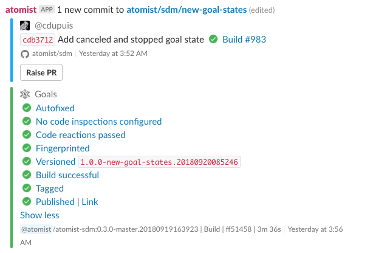

The most important SDM functionality relates to what
happens on a push to a repository. An SDM allows you to process a push
in any way you choose, but typically you want it to initiate a
delivery flow.

An SDM allows you to set **goals** on push. Goals correspond to the
actions that make up a delivery flow, such as build and
deployment. 

The goals set on a push are not the same every time. The delivery flow is not the same
for every change! 

Goals aren't configured per repository. They are chosen dynamically, in response to any
push in any repository, based on the code and the context. What kind of project is it?
What branch was pushed? Is there a pull request? Which files changed?

Goals are not necessarily sequential--by default they execute
in parallel--but certain goals, such as deployment, have preconditions
(goals that must have previously completed successfully).

In Slack, a push notification with several goals looks like this:



This page shows how to
*  create goals
*  teach them what to do
*  require approval

The next page describes how to [set goals for each push][setting-goals].


[setting-goals]: set-goals.md (Setting Goals in an SDM)

## Create goals

Set up goals wherever you configure your SDM, probably in `lib/machine/machine.ts`. This example comes
from [an SDM for Java Spring Boot web services](https://github.com/atomist-seeds/spring-sdm/blob/master/lib/machine/machine.ts).

A [Goal][goal-apidoc] object supplies its name, descriptions for its various possible states, and an implementation.

[goal-apidoc]: https://atomist.github.io/sdm/classes/_lib_api_goal_goal_.goal.html "API docs for Goal"

There are several built-in goal implementations, or you can [create your own](#custom-goals.md). 

For instance, an Autofix goal has one autofix registered on it; it will add license headers to any 
code file that doesn't have one yet, and make a commit.

```typescript
    const autofix = new Autofix().with(AddLicenseFile);
```

After you've created some goals, [choose when to set them][setting-goals].

## Built-in Goals

A goal object has some identifying information, code to fulfill the goal, and sometimes preconditions (goals that need to complete before this one can go). Some common ones have their own constructors:

### AutoInspect

Run an inspection on the code; if the code doesn't pass, you can fail the goals or require approval (a button push). To use it, you'll need to create one, set it on each push, and register inspections on it.

Instantiate an empty one:

```typescript
export const codeInspection = new AutoCodeInspection();
```

And set it when you want it to run on a push. Here's the shortest way to run this goal on every push:

```typescript
    sdm.addGoalContributions(goalContributors(
        onAnyPush().setGoals(goals("Inspections").plan(codeInspection))))
```

Now the fun part: register inspections on it. Check the [Inspections][inspection] page for more on how to write inspections.
Once you have an [AutoInspectRegistration][AutoInspectRegistration], register it on your goal:

```typescript
codeInspection.with(MyAutoInspectRegistration)
    .with(AnotherInspectRegistration);
```

You can register any number of inspections. You can call `with` on the goal at any point in SDM configuration.

If no inspections are registered, the goal will succeed. If any registration's `onInspectionResult` returns "fail", the goal will fail. If none return "fail" but one returns "require approval", the goal will go to Waiting for Approval state until someone clicks the Approve button in Slack or on the Atomist dashboard. 

[AutoInspectRegistration]: https://atomist.github.io/sdm/interfaces/_lib_api_registration_autoinspectregistration_.autoinspectregistration.html (AutoInspectRegistration API Doc)
[inspection]: inspect.md (Automatic Code Inspections)

### Autofix

{!tbd.md!}

### PushImpact

{!tbd.md!}

### Build

{!tbd.md!}

### Fingerprint

{!tbd.md!}

## Custom Goals

Define your own goal, with a name and descriptions and a function for how to execute it.

Use the `createGoal` function from @atomist/sdm; pass it an object with a `displayName` and as many properties out of [GoalDefinition][goaldef-apidoc] as you choose.
Also pass a function to call when it's time to execute the goal. That function can return void or an [ExecuteGoalResult][egr-apidoc].

For example:

``` typescript
const releaseDocs = createGoal(
    { displayName: "Release Docs", preApprovalRequired: true }, 
    async (inv: GoalInvocation) => {
        // do what is needed
        return { code: 0, targetUrl: "https://where-i-put-them" };
    });
```

[goaldef-apidoc]: https://atomist.github.io/sdm/interfaces/_lib_api_goal_goal_.goaldefinition.html (GoalDefinition API Doc)
[egr-apidoc]: https://atomist.github.io/sdm/interfaces/_lib_api_goal_executegoalresult_.executegoalresult.html (ExecuteGoalResult API Doc)

### Requiring approval

{!tbd.md!}

