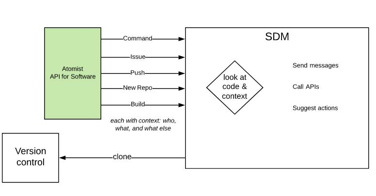

Atomist is a flexible platform, enabling you to build your own
automations or use those provided by Atomist or third parties.  An
Atomist Software Delivery Machine (SDM) provides a high-level
interface for you to take action when things happen.  In much the same
way your CI build kicks off when you push to your repository, Atomist can
execute tasks like security scans, documentation publication, release
creation, and deployment when different events occur within your
development environment.  Because you're using a real programming
language, not YAML or Bash, and you have access to a real ecosystem,
Node.js, you can create a richer delivery experience than you've even
imagined.

A SDM demonstrates Atomist as the *API for software*, exposing:

-   *What we know*: The Atomist cortex, accessible through GraphQL
    queries and subscription joins
-   *What just happened*: An event, triggered by a GraphQL
    subscription, which is contextualized with the existing knowledge
-   *What you're working on*: A library that enables you to comprehend
    and manipulate the source code you're working on.

When a push occurs, the SDM gets all this context and the code. It decides what
delivery actions to take, and sets a goal for each one.

A push is not the only event that matters in our software development.
The Atomist development automation platform ingests events from your
software development systems:

-   Source code repositories like [GitHub.com][gh]
    and [GitHub Enterprise][ghe]
-   Issue tracking systems like [GitHub][gh-issues] and [Jira][jira]
-   Continuous integration platforms
    like [Travis CI][travis], [CircleCI][circle],
    and [Jenkins][jenkins]
-   Application frameworks like [Spring][spring]
-   Runtime platforms like [Kubernetes][k8] and [Cloud Foundry][cf]
-   Custom events from _any_ other system you use

and makes them available via the Atomist API for software.

As Atomist ingests events, typically via webhook JSON payloads, it
automatically correlates them to each other: commits to pushes to
builds to deployments to running containers. This results in a data
model that represents your development flow.  The Software Delivery Machine subscribes to the most important events,
like a push to source control and a completed build. You can subscribe to more
events and take action when they occur, with the data model providing
the necessary context so your automations can always do the right
thing. 

The development automation platform also provides a simple yet
powerful interface for implementing custom chat bot commands,
also executable from your command line.  Atomist
provides all the infrastructure needed to recognize commands, collect
parameters, execute the code, and respond.  This lets you focus on
writing your command code, not boilerplate code and ceremony
around running bots. Instead of shell scripts that are useful to you, write commands
that help your whole team.

[gh]: https://github.com (GitHub.com)
[ghe]: https://enterprise.github.com/home (GitHub Enterprise)
[gh-issues]: https://guides.github.com/features/issues/ (Mastering GitHub Issues)
[jira]: https://www.atlassian.com/software/jira (Jira)
[travis]: https://travis-ci.org (Travis CI)
[circle]: https://circleci.com (CircleCI)
[jenkins]: https://jenkins.io/ (Jenkins)
[spring]: https://spring.io/ (Spring)
[k8]: https://kubernetes.io/ (Kubernetes)
[cf]: https://www.cloudfoundry.org/ (Cloud Foundry)
[ts]: https://www.typescriptlang.org/ (TypeScript)
[sdm]: https://github.com/atomist/sdm (Atomist SDM - TypeScript)
[sdm-core]: https://github.com/atomist/sdm-core (Atomist SDM - TypeScript)
[aac]: https://www.npmjs.com/package/@atomist/sdm (Atomist SDM Node Module)

## Local

While the SDM is most valuable when it is coordinating delivery and
performing commands for your whole team, you can also test and operate
an SDM in local mode, on your laptop, without connecting to the
Atomist API.  Check the [Developer Quick Start][quick-start] for
instructions to get started locally.

[quick-start]: ../quick-start.md (Atomist Developer Quick Start)

---

# About this guide

With this guide, we aim to provide all the information you need to create and customize
a software delivery machine for your organization's needs. When the information here
is not clear or not sufficient, we appreciate your perspective. Ask us questions through the chat icon
in the lower-right of this page; or on the [Atomist community Slack][slack]. You can also contribute
to this guide by creating issues or pull requests on [the docs repository][docs].

If you want to learn by doing, run through the [Developer Quick Start][quick-start] first.
If you want to start from higher-level concepts, begin reading [about the SDM][sdm].

This guide should help you make your SDM:

-   [Build your repositories][build], more flexibly than a pipeline
-   [Deploy your code][deploy], with interactivity
-   [Inspect your code][inspect], across projects and automatically on push
-   [Transform your code][autofix], across projects and automatically on push
-   [Respond to builds][build-event], from the SDM or external build systems
-   Implement [custom commands][command]
-   [Create new projects][create] according to your own standards

To do all this, these higher-level concepts are relevant:

-   [Setting up your system][prereq] to develop and run
    automations like SDMs
-   [Software Delivery Machine][sdm]
-   [Commands][command]
-   [Goals][goal]
-   the [Project][project] interface

## Advanced topics

-   Crafting sophisticated [Slack messages][slack]
-   Using [GraphQL to subscribe to events][graphql-api]
-   [Deploying your SDM][sdm-deploy]

Once you've finished this section, you'll have everything
you need to eliminate the pain points in your development and delivery
processes.

[build]: build.md (Builds in the SDM)
[deploy]: deploy.md (Deploys in the SDM)
[inspect]: inspect.md (Code Inspections)
[autofix]: autofix.md (Transforms and Autofix)
[docs]: https://github.com/atomist/docs (Atomist Documentation Repository)
[goal]: goal.md (Goals)
[prereq]: prerequisites.md (Atomist Automation Prerequisites)
[sdm]: sdm.md (Atomist Software Delivery Machine)
[command]: commands.md (Atomist Command Automations)
[event]: events.md (Atomist Event Automations)
[slack]: slack.md (Atomist Automation Slack Messages)
[graphql-api]: graphql.md (Atomist Automation GraphQL)
[project]: project.md
[create]: create.md
