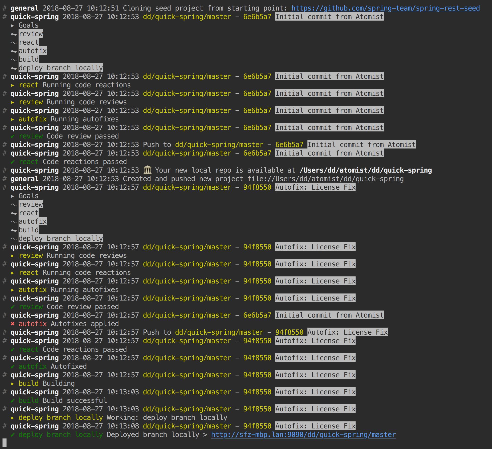
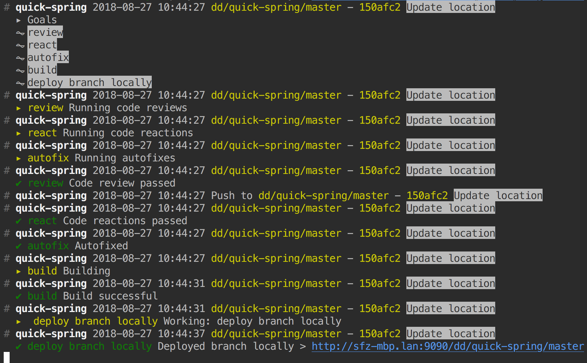

The easiest way to get started with Atomist is to start on your
laptop, working with local commits.  You'll need [Git][git],
[Node.js][node], and the [Java JDK][jdk] installed.

[git]: https://git-scm.com/downloads  (Install Git)
[node]: https://nodejs.org/ (Node.js)
[jdk]: http://jdk.java.net/ (Java JDK)

## Quick start

1.  Install the Atomist command-line utility.

        npm install -g @atomist/cli

2.  Create a local software delivery machine (SDM).

        atomist create sdm

    Select the default machine, `spring`.  When prompted for the name
    of the target repository, enter `quick-sdm`.  When prompted for a
    target owner, enter your user name.

3.  Change into the newly created SDM project.

        cd ~/atomist/<your user name>/quick-sdm

4.  Start your local SDM.

        atomist start --local

    The above command will install the project dependencies using NPM,
    compile the TypeScript, and start your SDM.  Depending on your
    network connect, this may take a minute or more.

5.  In another terminal, start up the SDM feed so you can see what the
    SDM is doing.

        atomist feed

6.  In another terminal, create a [Spring Boot][spring-boot] project.

        atomist create spring

    This command will connect to your locally running SDM and use its
    capabilities to create a new Spring Boot project for you.  When
    prompted for the target repository, enter `quick-spring`.  When
    prompted for group identifier and root package, enter `com.me` and
    `com.me.spring`, respectively.  When prompted for the target
    owner, enter your user name again.

    If you look in the terminal with the Atomist feed, you will see
    the SDM cloning the seed repository, cloning it locally, building
    it, and deploying it locally.  The first time you run this, it may
    take a few minutes as it downloads all the Maven and project
    dependencies.

    

    You can go to the URL provided for the local deployment and verify
    that your new Spring Boot application is running.

    

7.  Change into your newly created Spring Boot project.

        cd ~/atomist/<your user name>/quick-spring

8.  Change the message in your Spring Boot application.  Edit
    `src/main/java/com/me/spring/QuickSpringController.java`, changing
    "world" to your location.  Then commit your change.

        git add src/main/java/com/me/spring/QuickSpringController.java
        git commit -m 'Update location'

9.  Go back to the Atomist feed to observe your locally running SDM
    noticing your commit and respond by building and deploying your
    latest version.

    

    Go to the URL again and verify the message contains your location.

    

[spring-boot]: https://spring.io/projects/spring-boot (Spring Boot)

## Next steps

Learn more about what you can do with an SDM by going through the
[Atomist developer tutorials][tutorials].

When you're ready to put your SDM to work for your whole team,
continue with [setup][].

[setup]: user/index.md (Atomist Setup)
[tutorials]: https://github.com/atomist/developer-tutorials#readme (Atomist Developer Tutorials)
