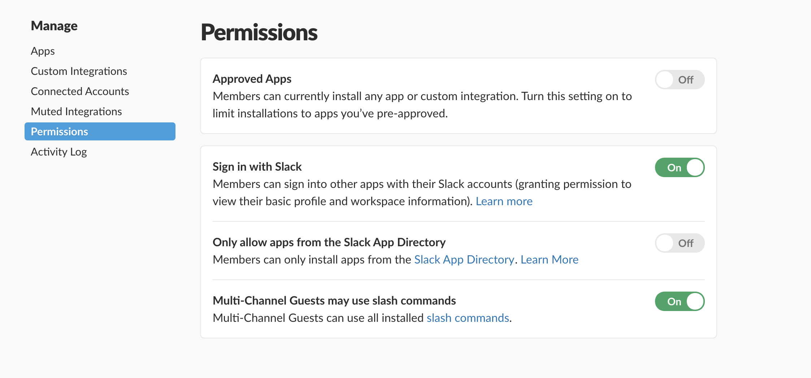

<script>
	/**
	* Function that tracks a click on an outbound link in Analytics.
	* This function takes a valid URL string as an argument, and uses that URL string
	* as the event label. Setting the transport method to 'beacon' lets the hit be sent
	* using 'navigator.sendBeacon' in browser that support it.
	*/
	var trackOutboundLink = function(url) {
		ga('send', 'event', 'outbound', 'click', url, {
			'transport': 'beacon',
			'hitCallback': function(){document.location = url;}
		});
	}
</script>

This is a step by step guide to setting up Atomist's built-in automations to see and control your development flow from [Slack][slack]. To write your own automations, see [Quick Start] or the full [Developer Guide]

[slack]: https://slack.com/ (Slack)

## Slack

### Enroll Slack bot

Click the "Add to Slack" button below to invite the Atomist Bot into your Slack team.

<div class="ss-container">
  <a href="https://atm.st/2wiDlUe" onclick="trackOutboundLink('https://atm.st/2wiDlUe'); return false;" target="_blank">
                    
  </a>
</div>

Slack's default configuration allows all team members to add new Slack applications.
However, your team's admins may decide to restrict the set of applications that can
can be added in your team.  The [Permissions management page][manage-permissions] has 
an "Approved Apps" setting to control this.

[manage-permissions]: https://slack.com/apps/manage/permissions



If your team requires approval for new apps, and you are not a Slack
admin, then Slack will you whether you'd like to request that the
Atomist application be approved (Slack is really helpful here!).

Currently the authorization process asks you to authorize two things:

1.  The Atomist app adds a bot user named "@atomist" to your team.
    Your team can `\invite` the Atomist bot to channels in order to
    access functionality that you deployed using the Atomist
    platform.  Bot users cannot create channels, cannot
    join channels unless they are invited by a non-bot channel member, 
    and cannot see messages in channels where they are not a
    member.  In other words, a bot might join your team when an
    authorization occurs, but it doesn't become a real part of your
    team until it has been invited to channels.
2.  Atomist requests a scope called "Modify public channels".  
    This scope allows Atomist to help you setup channels to bring
    information from external systems into Slack.  For example, when
    you create a project in a new GitHub repo, Atomist can help you
    direct events from that project into a new channel that only
    people working on that project decide to join.  The Atomist app 
    creates new channels on behalf of the user who first authorizes Atomist.

### Check Slack team IDs

Some operations need to know your Slack team ID, which the Atomist 
bot is happy to tell you.  Once you've added Atomist to your Slack team,
invite the Atomist bot to a channel and send it the `team` message.

```
you> /invite @atomist
you> @atomist team
atomist> The Slack id for team your-slack-team is T1L0V3JTP
         16 of 24 users in this team have authorized themselves
```

The above response tells you the Slack team ID is `T1L0V3JTP`.

### Removing Atomist from Slack

You can remove the bot from all your channels instantly
by revoking access to the "Atomist" application.  We certainly hope it 
doesn't come to this!

The [App Manage page][slack-app-settings] has a "Remove App" button at
the bottom of the page.  Please [let us know][support-email] if
there's anything we can do to clarify how the bot works with your
team's channels.

[slack-app-settings]: https://slack.com/apps/A0HM83NCC-atomist?page=1
[support-email]: mailto:support@atomist.com

## GitHub

Atomist helps you work with GitHub in two ways:

1.  By enabling web hooks, your automations can react to your team's 
    GitHub activity.
2.  Automations can expose Commands that utilize GitHub apis.  Each
    user on your team independently authorizes Atomist.  This means 
    that your automation's Commands remain sandboxed by the GitHub
    security model.

### Org-level Web Hooks


### Repo-level Web Hooks


## Continuous integration

Atomist natively supports several continuous integration
(CI) platforms, listening for CI events, correlating them with the
commits that triggered the build, and showing contextualized
notifications in a Slack channel linked to the repository.  To enable
this capability, just add the desired Atomist CI
webhook URL to your CI configuration.

In the examples below, replace `TEAM_ID` with your Slack team ID.

### CircleCI

To send events from [CircleCI][circleci] to Atomist, add the following
snippet to your `.circleci/config.yml` configuration file.

```yaml
notify:
  webhooks:
    - url: https://webhook.atomist.com/atomist/circle/teams/TEAM_ID
```

[circleci]: https://circleci.com/ (CircleCI)

### Jenkins

You can send events from [Jenkins][jenkins] to Atomist using
the [notification plugin][not-plugin], configuring it to send its
payload to
`https://webhook.atomist.com/atomist/jenkins/teams/TEAM_ID`.

If you configure your build using a [`Jenkinsfile`][jenkinsfile], add
these functions to your `Jenkinsfile`.  Don't forget to replace
`TEAM_ID` with your Slack team ID.

```groovy
import groovy.json.JsonOutput

def getSCMInformation() {
    def gitUrl = sh(returnStdout: true, script: 'git config --get remote.origin.url').trim()
    def gitSha = sh(returnStdout: true, script: 'git rev-parse HEAD').trim()
    def gitBranch = sh(returnStdout: true, script: 'git name-rev --always --name-only HEAD').trim().replace('remotes/origin/', '')
    return [ url: gitUrl, branch: gitBranch, commit: gitSha ]
}

def notifyAtomist(buildStatus, buildPhase="FINALIZED",
                  endpoint="https://webhook.atomist.com/atomist/jenkins/teams/TEAM_ID") {

    def payload = JsonOutput.toJson([
        name: env.JOB_NAME,
        duration: currentBuild.duration,
        build: [
            number: env.BUILD_NUMBER,
            phase: buildPhase,
            status: buildStatus,
            full_url: env.BUILD_URL,
            scm: getSCMInformation()
        ]
    ])
    sh "curl --silent -XPOST -H 'Content-Type: application/json' -d '${payload}' ${endpoint}"
}
```

Then call `notifyAtomist` when the build starts, e.g., in the first
stage, and ends, i.e., in the `post` block, sending the appropriate
status and phase.

-   Start: `notifyAtomist("STARTED")`
-   Succesful: `notifyAtomist("SUCCESS")`
-   Unstable: `notifyAtomist("UNSTABLE")`
-   Failure: `notifyAtomist("FAILURE")`

[jenkins]: https://jenkins.io/ (Jenkins)
[not-plugin]: https://wiki.jenkins-ci.org/display/JENKINS/Notification+Plugin (Jenkins Notification Plugin)
[jenkinsfile]: https://jenkins.io/doc/book/pipeline/jenkinsfile/ (Jenkinsfile)

### Travis CI

To send events from [Travis CI][travisci] to Atomist, add the
following snippet to your `.travis.yml` configuration file.

```yaml
notifications:
  webhooks:
    urls:
      - https://webhook.atomist.com/atomist/travis/teams/TEAM_ID
    on_success: always
    on_failure: always
    on_start: always
    on_cancel: always
    on_error: always
```

[travisci]: https://travis-ci.org (Travis CI)
